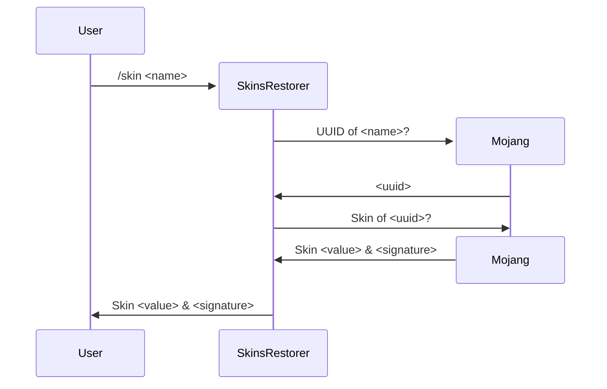

import {Callout} from "nextra-theme-docs";

# Inner workings of SkinsRestorer

<Callout type="info">
    We recommend reading the [storage page](/docs/development/storage) before reading this page,
    it explains a few basic concepts that are used in this page.
</Callout>

Want to know what SkinsRestorer does under the hood? This page touches on a few things that SkinsRestorer does, so you can understand how it works.

## Recap

As explained in the [storage page](/docs/development/storage), SkinsRestorer needs to ask Mojang for the skin of a player.
Mojang has built restrictions into their Minecraft client to prevent servers from settings skins of players without going through their servers.
The reason is likely that they want to prevent servers from setting explicit skins for players, so children are not exposed to inappropriate content.
They also use this to make capes exclusive to certain players, like Minecon attendees.

<Callout emoji="📔">
    Extra note: You can set any skin you want on Minecraft heads, the restrictions are only for player skins. (This also includes NPCs from Citizens)
</Callout>

We're using two methods to get you the skin you want.

1. Retrieve skin data of a Mojang player and apply their skin data to the player.
2. Use a network of accounts that apply any PNG file you want to a player and apply that skin data to the player.

For 2. we use [MineSkin](https://mineskin.org) to apply the skin data to the player from any PNG file you want.

## How does getting a skin look like?

Here is a simple flowchart:

## How does Ashcon help?

Ashcon API is a cache that allows us to distribute skin data to all servers that use SkinsRestorer.
This way, we don't have to ask Mojang for the skin data every time a player joins a server.
This is especially useful for large networks, where players can join different servers in the network.
The cache is also helpful for when Mojang's servers are down, as we can still get the skin data from the cache.
